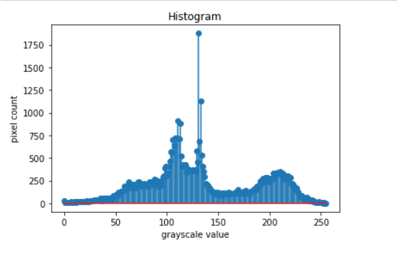
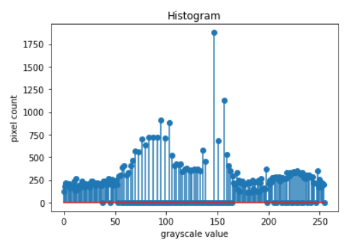
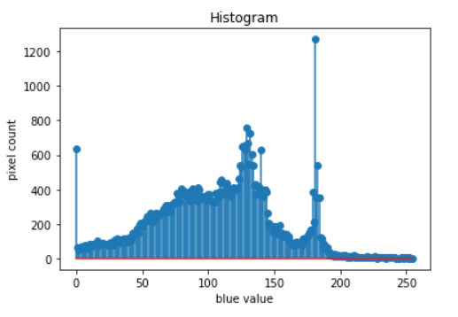
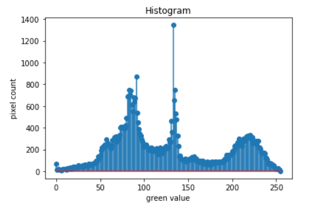
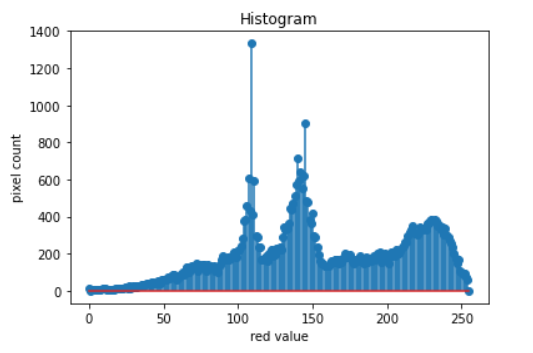

# HISTOGRAM
# Histogram and Histogram Equalization of an image
## Aim
To obtain a histogram for finding the frequency of pixels in an Image with pixel values ranging from 0 to 255. Also write the code using OpenCV to perform histogram equalization.

## Software Required:
Anaconda - Python 3.7

## Algorithm:
### Step1:
Import necessary libraries.

### Step2:
<br>
Use cv2.calcHist(images, channels, mask, histSize, ranges[, hist[, accumulate]]) to find the histogram of the image.


### Step3:
<br>
Plot the image and its stem plots using the plt.show() and plt.stem() functions.


### Step4:
<br>
Equalize the grayscale image  (cv2.equalizeHist().)


### Step5:
<br>
Print and end the program.


## Program:
```
Developed By: Jegathish S
Register Number: 212221230041
```

### Gray Scale Image:
```
import cv2
import matplotlib.pyplot as plt
gray_image =cv2.imread('thala.jpeg',0)
cv2.imshow('gray_image',gray_image)
cv2.waitKey(0)
cv2.destroyAllWindows()

hist = cv2.calcHist([gray_image],[0],None,[256],[0,255])

plt.figure()
plt.title("Histogram")
plt.xlabel('grayscale value')
plt.ylabel('pixel count')
plt.stem(hist)
plt.show()

#equalizing the image
equ_g = cv2.equalizeHist (gray_image)
cv2.imshow('EQUALIZED IMAGE',equ_g)
cv2.waitKey(0)
cv2.destroyAllWindows()
equal_hist = cv2.calcHist([equ_g],[0],None,[256],[0,255])

plt.figure()
plt.title("Histogram")
plt.xlabel('grayscale value')
plt.ylabel('pixel count')
plt.stem(equal_hist)
plt.show()

```
### Color Image:
```
import cv2
import matplotlib.pyplot as plt
color_image =cv2.imread('thala.jpeg',-1)
cv2.imshow('color_img',color_image)
cv2.waitKey(0)
cv2.destroyAllWindows()


# code to calculate the histogram of different channels of color image
hist0 = cv2.calcHist([color_image],[0],None,[256],[0,255]) #channel 0 - blue
hist1 = cv2.calcHist([color_image],[1],None,[256],[0,255]) #channel 1 - green
hist2 = cv2.calcHist([color_image],[2],None,[256],[0,255]) #channel 2 - red


# Display the histogram graph of different channels of color image
#channel 0 - blue
plt.figure()
plt.title("Histogram")
plt.xlabel('blue value')
plt.ylabel('pixel count')
plt.stem(hist0)
plt.show()


#channel 1 - green
plt.figure()
plt.title("Histogram")
plt.xlabel('green value')
plt.ylabel('pixel count')
plt.stem(hist1)
plt.show()


#channel 2 - red
plt.figure()
plt.title("Histogram")
plt.xlabel('red value')
plt.ylabel('pixel count')
plt.stem(hist2)
plt.show()

```
## Output:
### Gray Image
#### Input grayscale image:


#### Histogram of Grayscale Image


#### Histogram Equalized Grayscale Image


#### Equalized histogram of Grayscale Image


### Color Image
#### Input color Image


#### Histogram of different channels of color image
### Red

### Green

### Blue



## Result: 
Thus the histogram for finding the frequency of pixels in an image with pixel values ranging from 0 to 255 is obtained. Also,histogram equalization is done for the gray scale image using OpenCV.
